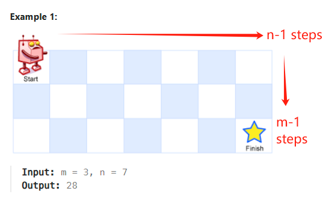

### [62. Unique Paths](https://leetcode.com/problems/unique-paths/description/?envType=study-plan-v2&envId=leetcode-75)
-  ### Revised1: Mathematic Solution
  - #### Since the robot can only walk towards right or down direction, the total steps for each direction is constant
  - #### For instance: for a 3x7 matrix, the total steps toward right is 6, and total one towards downward is 2
    
  - #### Thus the total steps is $C_{m+n-2}^{m-1} = C_{m+n-2}^{n-1}$
- ### Revised2: DP
    - #### DP from left-up to right-down
    - #### DP[i][j] = DP[i-1][j] + DP[i][j-1]
 
- #### How to init the DP matrix quickly in Python
  ```python
  dp = [[1]*n] + [[1]+[0] * (n-1) for _ in range(m-1)]
  ```
